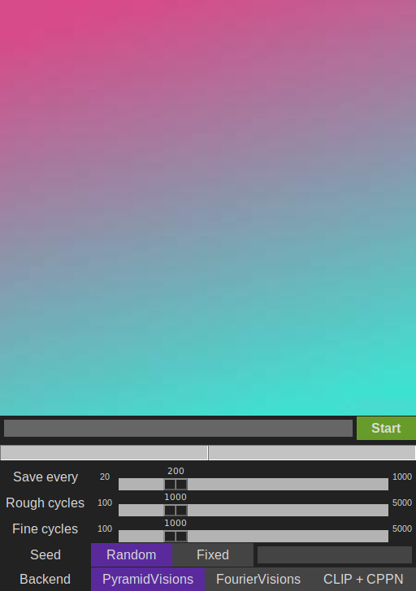

# Visions GUI

An offline python frontend for the [QuadVisions Colab Notebook](https://colab.research.google.com/drive/1qgMT4-_kDIgZnNGMmrxmwzT3N6Ittw6B?usp=sharing#scrollTo=OOd34BtkuK63) using [tkinter](https://docs.python.org/3/library/tkinter.html).
It offers basic options and interactively displays the generating image. So far PyramidVisions, FourierVisions and CLIP + CPPN are implemented. Image generation code: Jens Goldberg / [Aransentin](https://https//twitter.com/aransentin), Colab by Philipuss#4066.

## Installation
VisionsGUI was tested under Arch Linux and Windows 10 on a NVIDIA RTX 2070 Super. PyramidVisions and FourierVisions require a card with at least 4GB of VRAM, CLIP + CPPN requires more than 8GB. CPU only is currently not supported.
### Dependencies
Python and CUDA are required, the remaining dependencies can be installed via pip. Using a virtual environment like [venv](https://docs.python.org/3/library/venv.html) is preferred to keep the required pip packages seperate from your existing pip packages.
#### Arch Linux
1) Install Python 3 and pip via `pacman -S python python-pip`
2) Install the CUDA 11 toolkit via `pacman -S cuda`
3) Install the pip requirements: `pip install -r requirements.txt`

#### Windows
1) Install [Python 3](https://www.python.org/downloads/windows/)
2) Install the [CUDA 11 toolkit](https://developer.nvidia.com/cuda-downloads?target_os=Windows&target_arch=x86_64)
3) Install the pip requirements: `pip.exe install -r requirements.txt`

#### Other Linux distros
Python 3 should be available as a package for most distros but CUDA 11 might not be. In the latter case, an installer is available on [NVIDIA's site](https://developer.nvidia.com/cuda-downloads?target_os=Linux).

## Usage
To start, run `python visions-gui.py`. An internet connection is only required when running a model for the first time. No connection is required after the model has been downloaded.

### Modules
The gui is made up of multiple modules which offer feedback to the user and allow to change a handful of settings.
#### Image viewer
The image viewer displays the current progress of the image and is periodically updated during generation. The displayed images are also accessible in the `images` folder.
#### Prompt bar
The prompt bar consists of a text field and a start / stop toggle button. A prompt is entered into the text field and the image will be generated as soon as the button is pressed. To stop, press the button again.
The button also serves as the gui's state:
|Color |State |
|-|:-|
|Green| The model is ready and waiting to be started |
|Yellow| The model is currently generating an image |
|Red| An error occured |
#### Progress bar
The progress bar shows the progress of all stages.
#### Settings panel
The settings panel contains a few option for generating an image. Not all settings are available for all models:
|Setting |Description |
|-|:-|
|Save every| Cycles completed before displaying and saving the next image. Lower values add more overhead. |
|Scale| Changes the size of the output image. |
|Rough cycles| Cycles during the first stage. |
|Fine cycles| Cycles during the second stage. |
|Seed| If a random or fixed seed is used. If fixed is selected, uses the the seed entered in the entry field to the right. |
|Backend| Which model to use |

## Add your own model
VisionsGUI is expanded by adding model code and model settings to two python models without having to modify the existing classes.
Have a look at the existing models and their settings definitions if you are unsure on how to set up the classes.
### Output
To work with the frontend, the model needs to save an image (currently `.png` support only) in the `images/.` folder.

### [models/.](models)
Create your inference module in the `models/.` folder. Each class in your module needs to inherit `ThreadedWorker` from `worker.thread`.

Set the model up in the constructor and make sure to call the constructor of `ThreadedWorker`.

Place the inference code in method called `function`.

Define a list of integers named `self.progress`. The length of the list corresponds to the amount of different stages present in your model. The length only influences how many progress bars are show in the gui. At least on stage is required, otherwise the frontend wont stop refreshing the image and progress bar after the model finishes. Update the progress list after each iteration.

### [model_settings.py](gui/model_settings.py)
Create a new class inheriting from `SettingsPanel`, accepting a tkinter `Frame` and with the following structure:
- A constant called `backend` pointing to your model class type.
In the constructor:
- Call the constructor of `SettingsPanel` with the `Frame`.
- A list called `self.options` containing instances of tkinter objects. These objects need to implement the `get` method which should return a dictionary of option names and their values.
- Call `self.pack_options()`
Define a method called `apply_options(self, model)` accepting an instance of your model. This function is called before the model is started:
- Get the current settings set by the user with `self.get_settings()`. This call returns a dictionary containing all option name and value pairs. If the same option name is used more than once, the dictionary will contain a list of values for that name.
- Set your model settings from the options above.

## Future stuff
- [x] Add DirectVisions
- [ ] UI support for multiple text / weight pairs
- [x] UI support for variable image sizes
- [ ] Compiled executables
